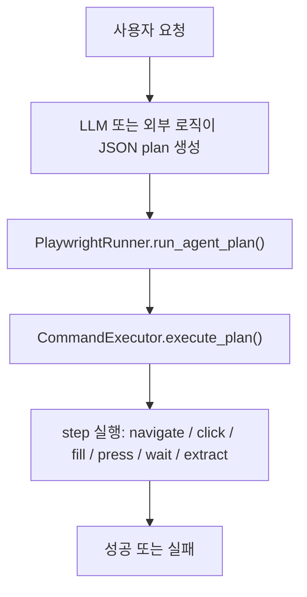
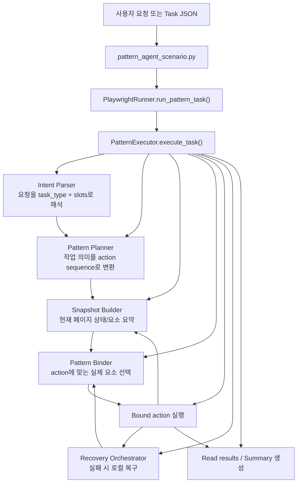
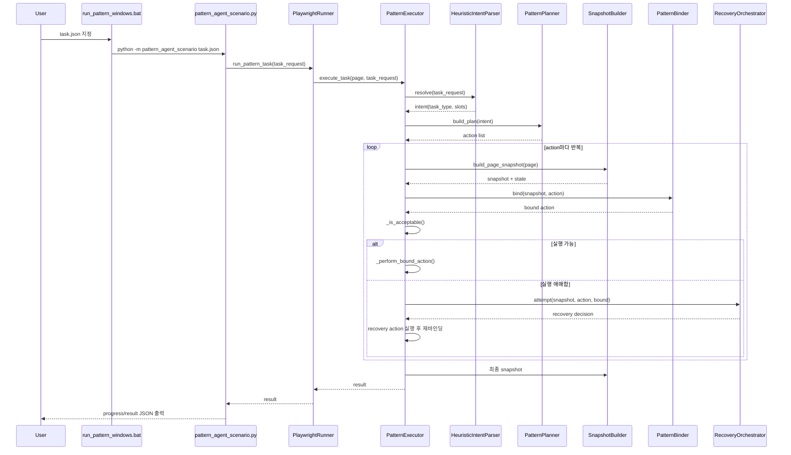

# Automation Architecture Overview

이 문서는 웹 자동화 엔진의 `기존 구조`, `현재 구조`, 그리고 `요청 1건이 들어왔을 때 실제 함수 호출 순서`를 쉽게 설명하기 위한 문서다.

## 1. 한 줄 요약

- 기존 구조: 미리 만들어진 저수준 JSON step을 Playwright가 그대로 실행
- 현재 구조: 자연어/intent를 받아 의미 기반 plan을 만들고, 현재 화면 상태를 해석해 적절한 요소를 골라 실행

---

## 2. 기존 구조도



### 쉽게 설명

- 예전 구조에서는 먼저 `어디를 클릭하고`, `어디에 입력하고`, `언제를 기다릴지`가 이미 정해진 plan이 필요했다.
- 실행기는 그 plan을 비교적 충실하게 실행하는 역할이었다.
- 장점은 명확하다. plan만 정확하면 동작이 단순하다.
- 단점도 명확하다. plan이 흔들리면 실행도 흔들린다.

### 핵심 파일

- `local_server/app/automation/browser/playwright_runner.py`
- `local_server/app/automation/browser/command_executor.py`

---

## 3. 현재 구조도



### 쉽게 설명

- 지금 구조에서는 먼저 “이게 검색인지, 길찾기인지”를 파악한다.
- 그 다음 “검색이면 입력 -> 자동완성 -> 검색 버튼 -> 결과 읽기” 같은 의미 기반 흐름을 만든다.
- 그리고 현재 페이지에서 실제 검색창, 자동완성 항목, 검색 버튼을 점수로 골라낸다.
- 그래서 사이트별 selector를 직접 하드코딩하지 않아도 어느 정도 공통 패턴으로 실행할 수 있다.

### 핵심 파일

- `local_server/app/simulation/pattern_agent_scenario.py`
- `local_server/app/automation/browser/playwright_runner.py`
- `local_server/app/automation/engine/pattern_executor.py`
- `local_server/app/automation/engine/snapshot_builder.py`
- `local_server/app/automation/engine/binder.py`
- `local_server/app/automation/engine/recovery.py`
- `local_server/app/automation/core/task_registry.py`
- `local_server/app/automation/core/schemas.py`
- `local_server/app/automation/llm/intent_parser.py`

---

## 4. 현재 구조에서 새로 생긴 개념

### 4.1 Intent

사용자 요청을 이런 형태로 바꾼다.

```json
{
  "task_type": "keyword_search",
  "slots": {
    "query": "오늘 날씨"
  }
}
```

또는

```json
{
  "task_type": "paired_lookup",
  "slots": {
    "source": "송내역",
    "target": "서울역"
  }
}
```

즉 “사이트별 시나리오”가 아니라 “작업 의미”를 먼저 고정한다.

### 4.2 Action DSL

실행기는 저수준 selector 명령 대신 아래 같은 의미 기반 action을 다룬다.

- `open_primary_entry`
- `fill_slot`
- `choose_suggestion`
- `submit_primary`
- `read_results`

### 4.3 Snapshot

현재 페이지의 전체 HTML을 다루지 않고, 아래만 요약한다.

- 지금 보이는 입력창/버튼/패널
- 현재 상태 (`input_ready`, `suggestion_open`, `results_ready`)
- 결과 영역 후보

### 4.4 Binder

액션에 맞는 요소를 점수로 선택한다.

예:

- `fill_slot(query)`면 검색창을 찾는다
- `choose_suggestion`이면 자동완성 option을 찾는다
- `submit_primary`면 검색 버튼을 찾는다

---

## 5. 요청 1개가 들어왔을 때 실제 함수 호출 순서

## 5.1 패턴 엔진 공통 호출 순서



---

## 5.2 네이버 검색 예시 호출 순서

사용자 요청: `네이버에서 오늘 날씨 검색해줘`

### 내부 흐름

1. `pattern_agent_scenario.run(task_path)`
2. `PlaywrightRunner.run_pattern_task(task_request)`
3. `PatternExecutor.execute_task(page, task_request)`
4. `HeuristicIntentParser.resolve()` 또는 task JSON의 `intent` 사용
5. `PatternPlanner.build_plan()`
6. 만들어진 plan 예시
   - `open_primary_entry` (optional)
   - `fill_slot(query="오늘 날씨")`
   - `choose_suggestion(query="오늘 날씨")`
   - `submit_primary`
   - `read_results`
7. 각 step마다
   - `build_page_snapshot()`
   - `PatternBinder.bind()`
   - `_perform_bound_action()`
8. 네이버는 자동완성 클릭만으로 결과 페이지가 뜰 수 있어서
   - `PatternExecutor._should_skip_submit()`가 결과 페이지 여부를 확인
   - 이미 결과가 보이면 `submit_primary`는 스킵
9. `read_results`가 결과 영역을 읽고 summary 생성

---

## 5.3 네이버 지도 길찾기 예시 호출 순서

사용자 요청: `네이버 지도로 송내역에서 서울역 가는 경로 알려줘`

### 내부 흐름

1. `pattern_agent_scenario.run(task_path)`
2. `PlaywrightRunner.run_pattern_task(task_request)`
3. `PatternExecutor.execute_task(page, task_request)`
4. intent:
   - `task_type = paired_lookup`
   - `slots.source = 송내역`
   - `slots.target = 서울역`
5. plan 예시
   - `open_primary_entry(label="route")`
   - `fill_slot(source)`
   - `choose_suggestion(source)`
   - `fill_slot(target)`
   - `choose_suggestion(target)`
   - `submit_primary(label="route")`
   - `read_results`
6. Binder가
   - 길찾기 버튼
   - 출발/도착 입력창
   - 자동완성 option
   - 길찾기 실행 버튼
   - 결과 영역
   을 순서대로 찾아 실행

### 네이버 지도에서 별도로 보강된 점

- 초기 검색창과 길찾기 입력창을 구분
- 출발/도착 입력창이 label 없이 나와도 순서 기반으로 구분
- 자동완성 option의 점수를 더 높게 부여
- route 탭 버튼과 실제 route 실행 버튼을 구분
- 결과 region이 뚜렷하지 않으면 body fallback으로 읽기 가능

---

## 6. 기존 구조와 현재 구조의 차이를 아주 쉽게 설명하면

### 기존 구조

- “어디를 눌러야 하는지”를 먼저 정하고 실행
- 실행기는 상대적으로 단순
- plan 품질에 크게 의존

### 현재 구조

- “무슨 작업인지”를 먼저 이해하고 실행
- 실행기는 화면을 보고 스스로 요소를 고름
- 사이트별 매크로보다 공통 패턴 재사용에 유리

---

## 7. 실제로 바뀐 파일 역할 요약

### 새로 추가되거나 핵심 변경된 파일

- `local_server/app/automation/browser/playwright_runner.py`
  - 기존 `run_agent_plan()`은 유지
  - 새 `run_pattern_task()` 추가

- `local_server/app/automation/engine/pattern_executor.py`
  - 새 패턴 엔진의 메인 실행기
  - action 반복 실행, 복구, 요약 담당

- `local_server/app/automation/engine/binder.py`
  - 현재 화면에서 어떤 요소를 누를지 점수로 선택

- `local_server/app/automation/engine/snapshot_builder.py`
  - 현재 화면 상태와 candidate snapshot 생성

- `local_server/app/automation/core/task_registry.py`
  - task_type별 action template 정의

- `local_server/app/automation/core/schemas.py`
  - Intent, TaskRequest, ActionStep, HostBias 등 공통 스키마

- `local_server/app/automation/llm/intent_parser.py`
  - 자연어를 task_type/slots로 해석

- `local_server/app/simulation/pattern_agent_scenario.py`
  - task JSON을 받아 새 엔진을 실행하는 진입점

- `scripts/run_pattern_windows.bat`
  - 새 패턴 엔진 실행용 배치 파일

---

## 8. 지금 구조의 장점

- 사이트별 JSON step을 일일이 만들지 않아도 된다
- 검색형 사이트처럼 비슷한 패턴을 재사용할 수 있다
- 실패 원인을 `바인딩 실패`, `상태 오판`, `결과 영역 미검출`처럼 구조적으로 볼 수 있다
- recovery를 로컬 규칙으로 먼저 처리할 수 있다

## 9. 아직 남은 한계

- 결과 읽기 품질은 사이트마다 편차가 있다
- 같은 `keyword_search`라도 자동완성/결과 페이지 구조 차이가 크다
- `submit_primary`나 `read_results`는 계속 보정이 필요한 영역이다

---

## 10. 추천 디버깅 순서

문제가 생기면 아래 순서로 보는 것이 좋다.

1. `intent`가 맞게 생성됐는가
2. `plan`이 의도한 action sequence인가
3. `snapshot.state`가 맞는가
4. `binder.top_candidates` 상위 3개가 납득 가능한가
5. 실제 클릭/입력 후 상태가 기대대로 바뀌는가
6. 결과 영역이 region으로 잡히는가

